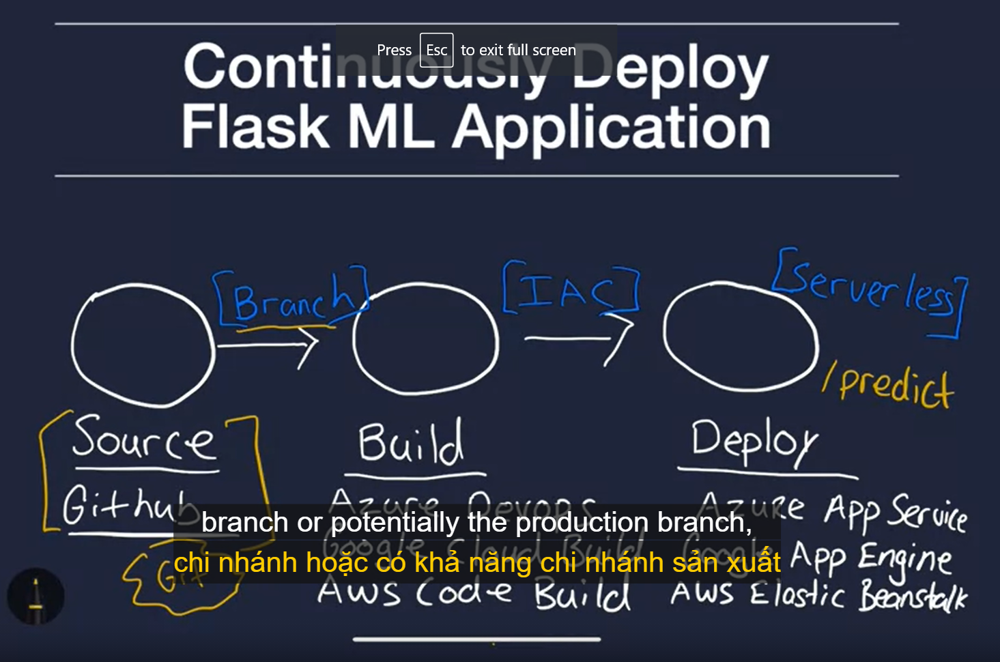

# cloud-computing-for-ml
Building Cloud Computing Solutions at Scale Specialization - Coursera

[Coursera | Online Courses & Credentials From Top Educators. Join for Free | Coursera](https://www.coursera.org/learn/cloud-machine-learning-engineering-mlops-duke/home/welcome)

# Week 1

Student example:

- [Movie Recommendation](https://github.com/ashishvinodkumar/Movie_Recommendation)
- [Real-time Amazon Stock Prediction Dash Application in AWS](https://github.com/PranavM98/Prediction-of-Stock-Prices---Dash-App)
- [YouTube Caption Sentiment and Stock Comparison Architect](https://github.com/Cloblak/youtube_sentiment_stock_prediction)
- [IMDB Data Analytics in GCP](https://github.com/DeanHuang-Git/imdb_analytics)

Các serverless của cloud providers trong CD

sử dụng AWS App Runer để tạo web service chạy python và có Continious delivery

url: [https://www.coursera.org/learn/cloud-machine-learning-engineering-mlops-duke/lecture/SXAQo/aws-app-runner-high-level-paas-continuous-delivery](https://www.coursera.org/learn/cloud-machine-learning-engineering-mlops-duke/lecture/SXAQo/aws-app-runner-high-level-paas-continuous-delivery)

document: [https://docs.aws.amazon.com/apprunner/latest/dg/getting-started.html#getting-started.create](https://docs.aws.amazon.com/apprunner/latest/dg/getting-started.html#getting-started.create)

⇒ App Runner sẽ nhận sourrce là container hoặc source code từ github ⇒ build và chạy 1 app service

Trong video bài học + document của aws, phần configuration mình thấy chỉ đang install library bth ⇒ vậy trường hợp tạo env phức tạp hơn (vd download model từ s3, config 1 số thứ,...) thì fai làm ntn? tạo 1 bash script và run file .sh đó đc ko? ⇒ có 1 số cách:

- dùng file config yaml để config các command cần run [https://aws.amazon.com/blogs/containers/introducing-aws-app-runner/](https://aws.amazon.com/blogs/containers/introducing-aws-app-runner/) (trong blog này cũng có helloworld sử dụng container làm source)
- Ngoài ra trong có thể dùng Makefile ([https://www.coursera.org/learn/cloud-machine-learning-engineering-mlops-duke/supplement/ppjHu/high-level-mlops-continuous-deployment](https://www.coursera.org/learn/cloud-machine-learning-engineering-mlops-duke/supplement/ppjHu/high-level-mlops-continuous-deployment)) ⇒ make install

azure: app service?

- github: [https://github.com/noahgift/azure-ml-devops](https://github.com/noahgift/azure-ml-devops)
- clip: [https://www.youtube.com/watch?v=rXXtJpcVems](https://www.youtube.com/watch?v=rXXtJpcVems)

gcp: dùng app engine

# Week 2: AutoML

Tuần 2 tác giả nói về AutoML ⇒ train model AI mà k cần . Tuy nhiên chỉ là đi qua về các loại AutoML đang , chưa đi cụ thể vào cái nào cả (có trình bày nhiều về azure nhưng chỉ là basic):

- Cloud:
    - [Create ML Apple](https://developer.apple.com/machine-learning/create-ml/)
    - Google Cloud (CV, NLP, Tabular)
    - AWS
    - Azure
- Open source:
    - [Ludwig](https://github.com/ludwig-ai/ludwig)

Chú ý là sau khi đã train đc model, có thể export ra các format khác nhau để sử dụng trong mobile, edge device, web,...

# Week 3: Edge Device / API AI

Tuần này tác giả cũng chỉ giới thiệu về edge device, api ai (cloud và on-premises), ko đi sâu vào chi tiết.

## Edge device

Có 1 số loại edge device như:

- Coral TPU: dùng chip TPU, xem hdan và setup thôi, ko có gì đặc biệt (model có thể dùng tflite, coral format)
- camera của AWS ⇒ dùng web AWS để deploy model
- AWS DeepRacer: robot giao hàng
- Intel USB

## API

Có thể sử dụng API của cloud provider như AWS, GCP, Azure để train và sử dụng model:

- AWS: AWS Comprehend (NLP), Rekognition (CV)
- GCP: AutoML Vision, AutoML Tables, AutoML NLP
- Azure: Azure AutoML

Hoặc tự tạo API bằng Flask, FastAPI

Khi deploy API bằng flask, có thể sử dụng các tools để test request per second như: ([https://www.coursera.org/learn/cloud-machine-learning-engineering-mlops-duke/lecture/Arzqq/checklist-for-building-professional-web-services](https://www.coursera.org/learn/cloud-machine-learning-engineering-mlops-duke/lecture/Arzqq/checklist-for-building-professional-web-services) )

- Open source: Locust (test giả lập số request per sec)
- Loader.io
